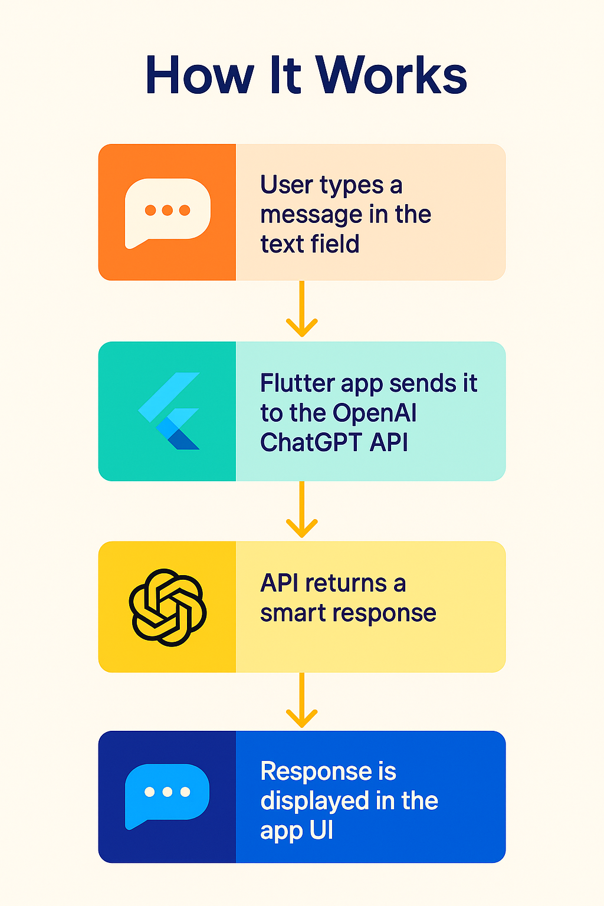

# 🤖 AI Agent with Flutter

A beginner-friendly Flutter app that integrates OpenAI's GPT (ChatGPT) to demonstrate how to build an AI agent using simple tools. Ideal for developers looking to explore AI integrations in cross-platform apps.

---

## 📱 Features

* Chat interface built with Flutter
* OpenAI GPT-3.5 integration
* Clean code structure
* Ready for enhancements (voice, memory, etc.)

---

## 🚀 Getting Started

### 1. Clone the Repo

```bash
git clone https://github.com/your-username/ai_agent_flutter.git
cd ai_agent_flutter
```

### 2. Install Dependencies

```bash
flutter pub get
```

### 3. Add Your OpenAI Key

Create a file called `lib/secret.dart`:

```dart
const String openAiApiKey = 'YOUR_API_KEY';
```

> 🔐 This file is ignored via `.gitignore`

### 4. Run the App

```bash
flutter run
```

---

## 💡 How It Works

1. User types a message in the text field
2. Flutter app sends it to the OpenAI ChatGPT API
3. API returns a smart response
4. Response is displayed in the app UI

---

## 📸 Screenshots

| Input                         | Output                        |
|------------------------------|-------------------------------|
|  |    |


---

## 📦 Packages Used

* [`http`](https://pub.dev/packages/http) - for API communication
* Flutter SDK

---

## 🧠 Project Structure

```bash
lib/
├── main.dart         # Main app logic
└── secret.dart       # Your API key (not committed)
```

---

## ✨ Future Improvements

* Voice support (speech-to-text & text-to-speech)
* Memory and context handling
* Firestore integration for chat history
* Flutter Web support

---

## 📄 License

MIT License

---

## 👨‍💻 Created By

**Dhiraj Singh Chandel**
[GitHub](https://github.com/Dhirajsingh-chandel) • [Blog](https://mobiledevinsights.blogspot.com/2025/07/building-ai-agent-with-flutter-simple.html)

> This project was created as part of my journey into AI + Flutter, and also used as a showcase for DevRel interviews to demonstrate technical storytelling, content creation, and developer education.

Happy building! 🚀
